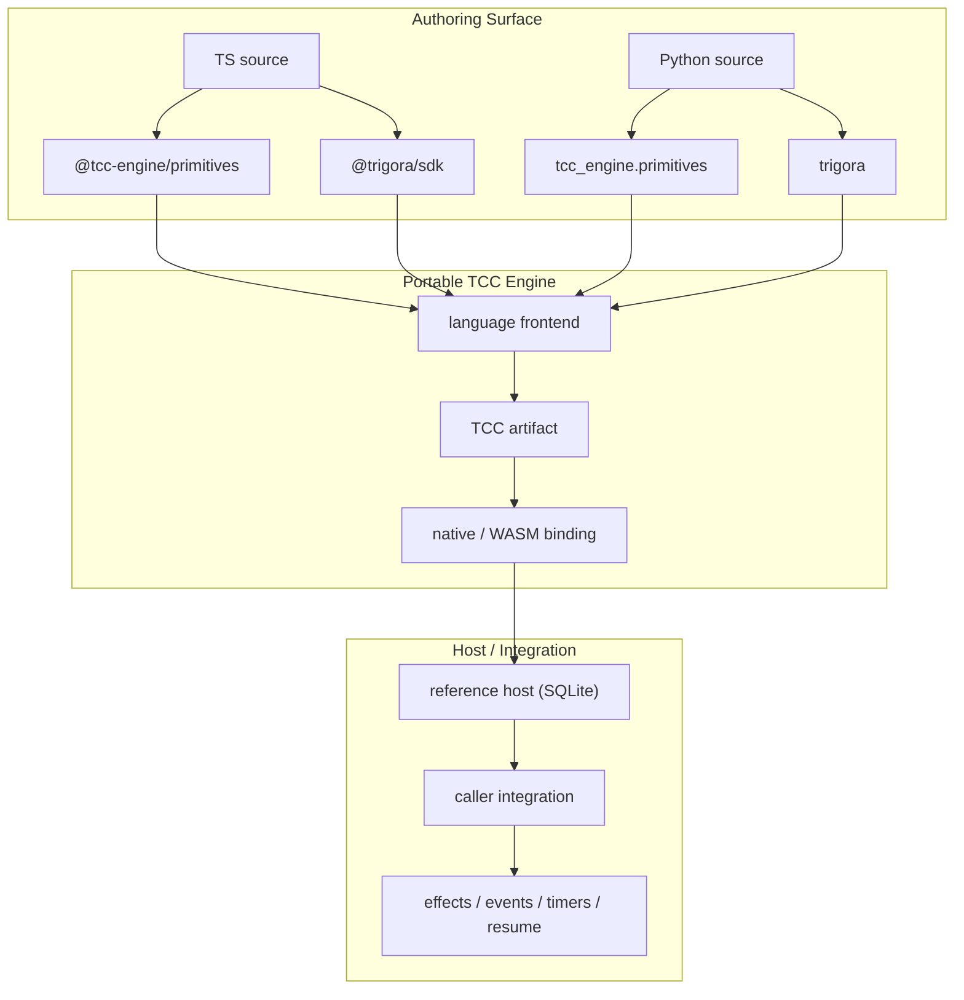

# TCC Engine

A portable compiler and runtime for recovering programs from committed continuation state.

TCC—Transparent Continuation Checkpointing—records the program position and live values needed to continue execution. After a failure, a runtime restores that continuation and resumes without re-executing the completed prefix.

TCC Engine is the portable execution engine underlying [Trigora](https://trigora.dev). You can embed it directly for development, testing, evaluation, and other uses permitted by the license, or use Trigora for a managed production runtime.

The core is Rust. It builds natively and to WebAssembly. A host supplies persistence, external effects, event delivery, and scheduling.

## Two paths

**Use Trigora** when you want the product surface: SDK, CLI, and a managed production runtime. Start at [trigora.dev](https://trigora.dev).

**Embed TCC Engine** when you want the compiler, native/WASM binding, and a reference SQLite host in your own process. Guide: [docs/embed.md](docs/embed.md).



Engine-native authoring is `@tcc-engine/primitives` / `tcc_engine.primitives`. Trigora authoring (`@trigora/sdk` / `trigora`) compiles to the same durable operations. The reference host is embeddable infrastructure, not a complete service: your process supplies effects, events, timers, and resume.

## How it works

Programs use explicit durable operations. A language frontend compiles supported source into a TCC artifact. The engine executes the artifact and stops at durable boundaries for the host. After the host commits the required state, the execution can be restored from that continuation and the artifact that produced it.

A host may keep an execution history for inspection. Recovery does not use that history to reconstruct program state.

## Recovery

Recovery loads the latest committed continuation.

- A continuation is valid only with the artifact that produced it. The engine does not migrate executions onto incompatible code.
- Restore cost depends on continuation size and the host's persistence implementation. It is not specified as constant-time.
- An external operation may succeed before its result is committed. Ambiguous outcomes are represented explicitly; idempotency is the provider's and the application's responsibility.
- Supported language constructs are those accepted by a frontend. Arbitrary TypeScript, Python, or third-party libraries are not implied.
- Persistence, wakeup, and fencing guarantees are properties of the host.

## Host protocol and conformance

A custom host talks [host protocol v1](spec/host-protocol.md) to the binding. It does not need the reference SQLite hosts or Trigora.

[Host conformance v1](spec/host-conformance-v1.md) is a named claim: protocol versioning, artifact pinning, reconstruct goldens in [`spec/fixtures/persist/`](spec/fixtures/persist/), and SIGKILL recovery at documented crash hooks. The kit is a generic runner plus host drivers. Semantic cases wrap the Node and Python SQLite adapters in this repository; a third-party host implements the same driver contract.

## This repository

This repository is the engine, its specifications, compiler frontends, embeddings, reference hosts, and conformance kit.

Use it to:

- Read the execution model
- Embed the engine
- Implement a host
- Implement a language frontend

## Layout

| Path | Role |
|---|---|
| `primitives/` | Engine-native TypeScript authoring package (`@tcc-engine/primitives`) |
| `crates/tcc-ir` | Program representation and validation |
| `crates/tcc-state` | Values and continuation encoding |
| `crates/tcc-core` | Execution |
| `crates/tcc-host` | Host protocol types and driver |
| `crates/tcc-wasm` | WebAssembly exports |
| `crates/tcc-python` | Native Python (PyO3) embedding |
| `frontends/` | Language frontends |
| `bindings/` | Language embeddings of the engine |
| `hosts/` | Reference hosts |
| `conformance/` | Host conformance v1 kit |
| `spec/` | Specifications |

A frontend compiles source to a TCC artifact. A binding loads the engine in a host language. They are not the same thing.

The execution core does not depend on a particular database, cloud provider, or SDK. WASM is a delivery and conformance target for that core, not TCC itself. Native embedding is the other path. The WASM target is `wasm32-unknown-unknown` and does not use WASI networking, filesystems, or threads.

## Status

The repository is under development. Present:

- Artifact envelope and validation
- Continuation encoding
- Host protocol v1 and host-conformance-v1
- Stepper, objects, arrays, control flow, exceptions, timers, cancellation, and child invoke
- TypeScript frontend: `@tcc-engine/primitives` and `@trigora/sdk` (`effect`, `waitForEvent`, `sleep`, `invoke`)
- Python frontend: `tcc_engine.primitives` and `trigora` (`effect`, `wait_for_event`, `sleep`, `invoke`)
- WASM C ABI, JavaScript binding, and an in-memory Node host
- Native PyO3 binding and SQLite Node/Python reference hosts
- Local `0.1.0-rc.1` npm packs and a Python wheel (not published to a registry)

Not present: a public engine registry release or a LICENSE file.

## Local packages (no Rust on the consumer)

Packaged compilers, primitives, the JS engine binding (with bundled WASM), the Node host, and the Python wheel so another repo can pin **local tarballs/wheels**.

```text
primitives  @tcc-engine/primitives           /  tcc_engine.primitives
compiler    @tcc-engine/frontend-typescript  /  tcc_engine.compile
binding     @tcc-engine/bindings-javascript  /  tcc_engine.EngineBinding
host        @tcc-engine/host-node            /  tcc_engine.host
```

Build packs and a wheel from this checkout:

```sh
pnpm install
pnpm pack:js
python -m venv .venv
.venv/bin/pip install maturin
( cd bindings/python && ../../.venv/bin/maturin build --release --out ../../dist-packages )
```

Tarballs and wheels land in `dist-packages/`. Install them elsewhere with `npm install ./tcc-engine-….tgz` and `pip install ./tcc_engine-….whl`. The JS binding’s `loadEngine()` uses the WASM file inside that package; do not pass a `target/…/tcc_wasm.wasm` path. The Node host needs Node 22 and `--experimental-sqlite`.

Portable manylinux/macOS wheels use cibuildwheel against `bindings/python/pyproject.toml`. Do not `npm publish` or upload to PyPI until the public `v0.1.0` cut.

## Development

Requires a current stable Rust toolchain.

```sh
cargo test --workspace
cargo clippy --workspace --all-targets
```

```sh
pnpm install
pnpm --filter @tcc-engine/frontend-typescript test
cargo build -p tcc-wasm --target wasm32-unknown-unknown --release
node --experimental-strip-types --test hosts/node-memory/src/host.test.ts
pnpm --filter @tcc-engine/host-node test
```

```sh
python -m venv .venv
.venv/bin/pip install maturin pytest
( cd bindings/python && ../../.venv/bin/maturin develop )
.venv/bin/pytest frontends/python hosts/python
```

## Specifications

- [Host protocol](spec/host-protocol.md)
- [Host conformance v1](spec/host-conformance-v1.md)
- [Durable operations](spec/durable-operations.md)
- [Program format](spec/program-format.md)
- [Execution semantics](spec/execution-semantics.md)
- [TypeScript subset](spec/typescript-subset.md)
- [Python subset](spec/python-subset.md)
- [First example](spec/examples/first.md)
- [First example (Python)](spec/examples/first-python.md)
- [Continuation format](spec/continuation-format.md)
- [Compatibility](spec/compatibility.md)

## Links

- [trigora.dev](https://trigora.dev)
- [SDK and CLI](https://github.com/trigora-dev/trigora)
- [Recovery demo](https://demo.trigora.dev)
- [Embed TCC Engine](docs/embed.md)
